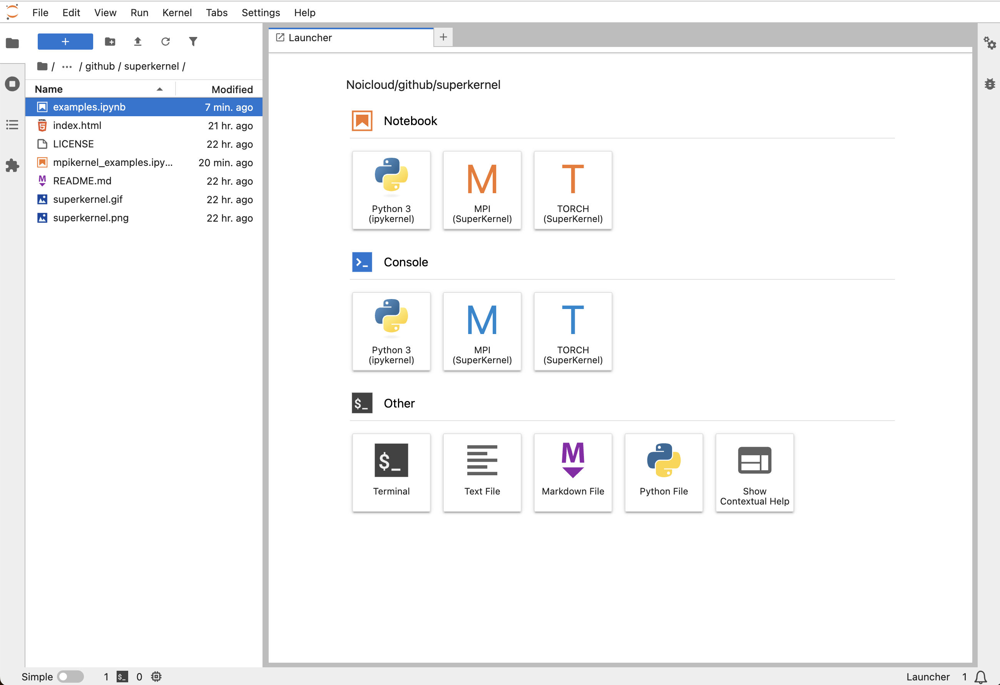

# SuperKernel

SuperKernel is a custom Jupyter kernel that brings supercomputing to your desktop — **without adding AI infrastructure complexity**.  

Run notebook cells across many GPUs and nodes via PyTorch Distributed (TorchRun). Perfect for AI, ML, and HPC at any scale.

SuperKernel unifies scale-up networking (NVLink, PCIe, CXL) with scale-out networking (RDMA, InfiniBand, Ethernet), making them work together as if they were one single kernel. Inspired by NVIDIA’s SuperPOD, SuperKernel transforms the notebook into a gateway to supercluster-class computing.

---

## Updates: Run Torchrun on clusters of GPUs 16 GPUs on one notebook kernel

---

## Updates: Run Torchrun and MPI clusters side by side

  

---

## Why SuperKernel?

- 🖥️ **Stay in Jupyter** — zero workflow change.
- ⚡ **Scale to clusters** — execute one cell on thousands of GPUs.
- 🔗 **Scale-up + Scale-out unified** — intra-node and inter-node networking exposed as one kernel abstraction.
- 🤖 **AI/ML native** — debug collectives, shard data, inspect per-rank state.
- 🔬 **Transparent** — per-rank outputs merged back into a single cell.
- 🌐 **Elastic** — provision instantly, scale elastically, and destroy completely when done.
- 🚫 **No more AI infra complexity** — scale with boundless simplicity, no new tools or platforms to learn.
- ♾️ **Boundless scale** — from your laptop to the world’s largest clusters, all from your notebook.

---

## Vision

> “One kernel, infinite scale — SuperKernel unifies scale-up and scale-out networking into a single execution space, unlocking AI/ML at supercluster scale with a single click. No more infrastructure headaches, just code and scale.”

SuperKernel = Scale-Up + Scale-Out → One Kernel

Just as NVIDIA’s SuperPOD showed how GPUs can be assembled into a supercomputer, SuperKernel shows how your notebook can become the control plane of a supercluster.

---

## Examples

See `examples.ipynb` for runnable cells that demonstrate:
1. **Cluster info** — `%info` magic shows world size, CUDA, devices.
2. **Multi-host shell** — run `!hostname` on every rank and merge results.
3. **All-Reduce** — interactive collective across ranks.
4. **Data sharding** — split a dataset by rank inside a single cell.
5. **Barrier timing** — measure sync latencies across the cluster.

---

## Learn More

- PyPI: (coming soon: superkernel)
- Backend: PyTorch Distributed
- Inspiration: NVIDIA SuperPOD

---

## Further Readings

To dive deeper into the ideas behind SuperKernel:
- [Distributed PyTorch (TorchRun)](https://pytorch.org/docs/stable/elastic/run.html)
- [NVIDIA NVLink and NVSwitch (scale-up networking)](https://www.nvidia.com/en-us/data-center/nvlink/)
- [RDMA and InfiniBand (scale-out networking)](https://community.mellanox.com/s/article/what-is-rdma-x)
- [NVIDIA SuperPOD — inspiration for cluster-scale AI infrastructure](https://docs.nvidia.com/dgx-superpod/reference-architecture/scalable-infrastructure-h200/latest/dgx-superpod-architecture.html)

---

SuperKernel:  

**No more AI infra complexity. Boundless scale. All from your notebook.**
